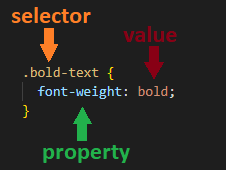
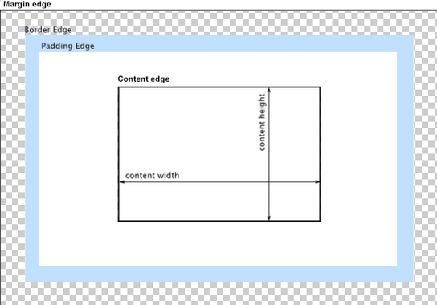
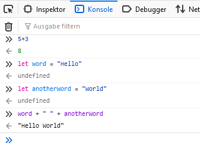

# What's web development?
In short, web developers build and maintain websites.    
Web developers often work for clients who are trying to get their product or service onto the web. The work is typically very project focused and involves collaborating with a team that helps to coordinate the client’s needs into the end product. The work could involve front-end, back-end, or full-stack web development.  
In our course we will focus on front-end development. The front end is what you see when you open any website in your browser. At a basic level, front-end developers use HTML, CSS and JavaScript.


## How to use this section
In the following we will briefly introduce HTML, CSS and JavaScript. Our intention here was not to go into every little detail there is (There have been whole books written about each of these!), but to give a broad overview of the different components and how they work together. The Udemy course will go over the concepts we outlay here and lots of additional content in more detail. Use this section as an appetizer and/or as a refresher to come back to once you've gone through the course.  


## HTML

HTML, short for Hypertext Markup Language, is the raw data that a webpage is built out of. It allows you to structure the website through sections, paragraphs, headings and lets you create text, links, cards, lists, and buttons.  
  
### Tags {-}  

The structure of a html file is very simple. Almost all elements are just pieces of content wrapped in opening and closing HTML tags. For example, you would write the title of a webpage like so: 
```{html}
<title>Document</title>  
```
And while the current version of HTML (HTML5) contains [140 different tags](https://www.w3schools.com/TAGS/default.ASP), most webpages are made just out of a fraction of these. You've already seen the title tag, let's quickly take a look at some more of those common ones. They are also the ones that you will most likely be using during your project.  
- ```<html>```: Must enclose the entire rest of the code  
- ```<head>```: Contains the title, the link to the css (styling) file and various other information  
- ```<body>```: Contains the contents of a website  
- ```<p>```: Paragraph, simple text belongs here  
- ```<hX>```: X is a number between 1 (large heading) and 6 (small heading)   
- ```<div>```: Structure that groups content inside  
- ```<ul>```: Unordered list containing list items ```<li>```    
- ```<a>```: Link tag, used to link from one website to the next   
- ``````: An image in an HTML page   
- ```<form>```: To create an HTML form for user input    
- ```<table>```: Defines a table, containing rows ```<tr>``` and columns ```<td>```  
- ```<button>```: Create a clickable button 

To all of these tags you can add classes or id's. An id has to be unique. Why would we do this!? We will get to that once we learn about CSS.     
```{html}
<div class="small-text">
  <p id="first-line">Name</p>
  <p id="second-line">Tom</p>
</div>
```
  
### Structure {-} 
  
Now that you know the majority of the relevant tags the only question left to answer is how do we actually write HTML code. For that it is relevant that all HTML documents have the same boilerplate-like structure that needs to be in place before anything useful can be done. The boilerplate looks something like this and is often easily accessible with a shortcut (so you don't have to type it all out everytime you create a new file): 
```{html}
<!DOCTYPE html>
<html lang="en">
  <head>
    <meta charset="UTF-8" />
    <title>Document</title>
  </head>
  <body>
  </body>
</html>
```
All of the content, that appears on a webpage is written between the ```<body>``` tags.  
So.. we know the basic structure and some HTML tags, but how and where do we write HTML Code? The answer is straight forward: We can write HTML Code anywhere! Even in a simple plain editor, as long as we save the code as .html we can view the results in the web-browser. But don't worry, there are more handy choices that we will look at in the [Tools Section][Tools]. Please note here, that we should always save the homepage of our websites as index.html. This is because web servers will by default look for an index.html page when users land on our websites - and not having one will cause big problems.  

Interesting reads  
- [The most used HTML tags (8 million website analyzed)](https://css-tricks.com/average-web-page-data-analyzing-8-million-websites/)

## CSS

Now we have a structure for the contents of a website, but to be frank: that looks horrible. The next step is to make that structure look good with some style, which is exactly what CSS, short for Cascading Style Sheets, is for. Using CSS, you can control the color of the text, the style of fonts, the spacing between paragraphs, how columns are sized and laid out, what background images or colors are used, layout designs, variations in display for different devices and screen sizes as well as a variety of other effects.  
  
### Syntax {-}  

The CSS Syntax is as straight forward as it was the case with HTML. It is a rule-based syntax and every rule is made up of a selector and a semi-colon separated list of property:value pairs.  
  
<center>



</center>
  
Let's go over how selectors work so you can get a feel for fit. If the goal is to style all elements of the same type in a certain way, simply reference the tag.  
```{css}
h1 {
  color: black;
}
```  
If you want to style multiple elements, that may be of different types, you use dot-notation and add a class to the element in HTML.
  
```{css, class.source="important"}
.bold-text {                           
  font-weight: bold
}
```
  
If you only want to style one element, you use the hashtag-notation and add an id to the element in HTML.
```{css, class.source="important"}
#header {                           
  font-size: x-large;
}
```
  
### Common properties {-}    

Now, let's check out the properties that you will encounter most often.  

- ```width```: specifies the width of the element's content area  
- ```height```: specifies the height of the element's content area  
- ```color```: defines the color of text, can be named, rgb(a) or hex value  
- ```background-color```: sets the background color  
- ```border```: specifies what kind of border to display     
- ```outline```: similar to border, but within the elements "box"  
- ```font-size```: Sets size of font (small, large..)  
- ```font-weight```: Sets weight of font (bold, italic..)   
- ```font-family```: Sets font style (arial, times...)   
- ```margin```: distance from the border of one element to the border of the other element    
- ```padding```:  distance from border to the content of the element  
  
### Box Model {-}  

CSS is based on the so-called box model: every element is a box. The content inside the element is a box, surrounded by the padding, surrounded by the border and surrounded by the margin.   
  
<center>



</center>
  
This schematic can also be found in every modern web browser. Simply open your favorite website in a new window, right click and then select „inspect“. This will open the „developer tools“ and allow you to check out the content of a page. With these developer tools, you can also alter the content of a website directly in the browser! However beware, these changes will not be saved and a reload will get rid of them.  
  
  

  
### Style.css {-}  

Great, now you know alot about CSS, but how can we combine it with our HTML code? There are several way's that you'll come across, but the most common way is to create a new file, by convention often named style.css, and put all our css code there. Afterwards we only have to link our created file in the head section of the html page and we are all set. For that to work, these files have to be in the same folder.  

```{html}
<!DOCTYPE html>
<html lang="en">
  <head>
    <meta charset="UTF-8" />
    <title>Document</title>
    <link rel="stylesheet" href="style.css" />
  </head>
  <body>...</body>
</html>
```
  
Interesting reads:  
- [The Box Model - test your box model skills with exercises](https://www.w3schools.com/css/css_boxmodel.asp)  
- [The Box Model on MDN (check out the sidebar aswell!)](https://developer.mozilla.org/en-US/docs/Learn/CSS/Building_blocks/The_box_model)

## JavaScript

Let's dive in to JavaScript now! The JavaScript code that we will be writing during this semester will be run via the browser. As described in the last part on CSS, you can open the developer tools of your browser. There you’ll also find the console. You can type any JavaScript command you like into the console, run it, and the browser will interpret the code for you. Let’s try a few examples:  

<center>



</center>  

### Code samples {-}  

Let's go over some more code. Feel free to type along in your console.    
```{JavaScript}
/* Variables */
let a = "hello"; /* Variables are simply storage containers */
a = "bye";       /* You use let to declare them if you expect the value to change */
const size = 10; /* You use const if you dont expect the value to change */

/* Primitive data types (boolean, string, number) */
let isHouseEmpty = false;             /* This is a boolean value and can either be true or false */
let ourOrganisation = "Tech Academy"; /* This is a string value */
let participants = 95  ;              /* This is a number value */

/* Compound data types (arrays, objects) */
let myArray = [1,2,3,4,5,6,7,8,9,10];                  /* This is an array, consisting of 10 numbers, you can get the first entry like this: myArray[0] */
let myObject = {name: "Sebastian", position: "Tutor"}; /* This is an object, to display the name you would type myObject.name */

/* Console.log */
console.log("Hello World!"); /* With console.log() we can print directly to the console. This is very handy to figure out if something's going wrong */

/* If statement */
let grade = 1.7; /* We declare a variable "grade" and store the value 1.7 in it */
if (grade < 2.0) { /* Our code checks if grade is less than 2.0 */
  console.log("Wow, impressive!"); /* If that's the case 'Wow, impressive!' is the output in the console */
}
else {
  console.log("Don't worry!"); /* If not, 'Dont't worry!' is the output */
}

/* For loop */
let myNumbers = [1,2,3,4,5];
for (let number of myNumbers) {
  console.log(number); /* Every number of myNumbers will be printed in a seperate line */
}

/* While loop */
let a = 90;
while (a >= 50) {
  a -= 10;  /* Our variable a will decrement by 10 as long as a is larger than 50 */
}
```

### The DOM {-}  

Now I bet you're asking how does this all link up to HTML and CSS? The DOM, or document object, is where it all comes together. The DOM is the most important object in JavaScript - it's the JavaScript representation of the structure of our HTML and is present in the variable document, when we load the page. Through the dom we can search through the document object,
```{JavaScript}
const header = document.getElementById("header");
```
add event listeners, that specify an action everytime the element is clicked on
```{JavaScript}
const button = document.getElementById("login-button");
button.addEventListener("click", () => {
  /* check if the user's credentials were valid */
})
```
and even change the style of our elements dynamically!
```{JavaScript}
const button = document.getElementById("login-button");
button.style.color = "red";
```
  
### Script.js {-}  

Obviously it doesn’t make sense to keep going in the browser as none of the code will persist. Similar to CSS, the most common approach is to add a new file, often named script.js and to place a script tag at the end of our HTML code to link to that file. The updated boilerplate will look like this:  
```{html}
<!DOCTYPE html>
<html lang="en">
  <head>
    <meta charset="UTF-8" />
    <title>Document</title>
    <link rel="stylesheet" href="style.css" />
  </head>
  <body>
    <!-- All the HTML code comes before the script tag -->
    <script src="script.js"></script>
  </body>
</html>
```
  
  
Want more practice? As a perfect supplement for the lessons in the Udemy course we recommend [this website](https://learnjavascript.online/) as it will allow you to practice JS hands on. After all, programming is not learned through tutorials, but by applying it yourself. We also highly encourage you to code along the instructor, Colt Steele, as this will further increase learning-speed.

Interesting reads:  
- [The History of JavaScript](https://medium.com/@_benaston/lesson-1a-the-history-of-javascript-8c1ce3bffb17)   
- [A (different) introduction to JavaScript](https://javascript.info/intro)  
- [Functions in JavaScript](https://javascript.info/function-basics)

