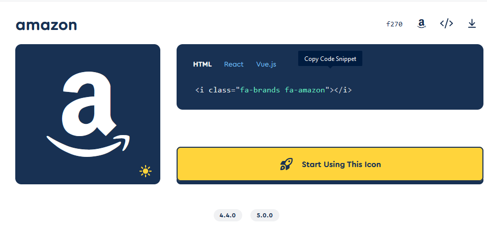

# 👨🏫 Additional Resources

### Git and GitHub

What’s Git? Git is like an epic save button for all your code, files and directories. In fancy language it’s also called a version control system.\
Why is the save so epic? Well, a “normal” save, for example in a word file, records all of the words in that file at the moment you hit the save button. You are only ever given one record of the file, such as essay.doc, unless you make duplicate copies (which is difficult to remember to do and keep track of).

However, a save in Git records differences in the files and folders AND keeps a historical record of each save. This let’s you review how your project grows and easily go back to any state from the past. If you connect it to a network, such as GitHub, it allows for collaboration among work colleagues, open-source projects and showcases your skills to the world!\
We encourage you to sign up to github [here](https://github.com/) and download git [here](https://git-scm.com/downloads) as well as check out this [video](https://www.youtube.com/watch?v=SWYqp7iY\_Tc) for the ultimate git crash course.

### JSON

JSON (JavaScript Object Notation) is a text format for storing and transporting data. It’s based on the notation of objects in JavaScript and easy to understand. We will deal with JSON data when we fetch from the openweather API in this course. As everything, it’s pretty simple to understand once we get into the doing.

```json
{
   "book": [
    
      {
         "id":"01",
         "title": "HTML5 and CSS3",
         "edition": 3,
         "author": "Jürgen Wolf",
         "read": true,
      },
    
      {
         "id":"02",
         "title": "JavaScript &JQuery",
         "edition": 2,
         "author": "Jon Duckett",
         "read": false,
      }
   ]
}
```

As you can see, data is represented by comma-separated name:value pairs. Every curly brace holds an object, and if you want to bundle multiple objects together you can use arrays, that are represented by square brackets and separated by comma. The value can hold different data types, in the example above and most commonly used are strings, numbers, boolean values or other objects.

To extract the information stored in the JSON data, we can access the values much like with JavaScript objects. Let’s assume that we have stored the example-json in a variable called data, thus:

```javascript
let firstId = data.book[0].id /*This would yield 01 */
let jsAuthor = data.book[1].author /* This would result in John Duckett */  
```

### Font Awesome

Font Awesome has a library of awesome icons, that are simply integrated in your project and can make quite the difference optically. Take a look [here](https://fontawesome.com/search?m=free) to check out the icons. With a click on any of the icons you get shown the respective html code, that you can just copy and paste into your file.

<figure><figcaption></figcaption></figure>

There’s just one more quick thing to do before you can use them in your project, you have to register [using this link](https://fontawesome.com/v6/docs/web/setup/get-started) and add your personal script-tag, that you will get after the registration in the head section of your html file.

```html
<!DOCTYPE html>
<html lang="en">
  <head>
    <meta charset="UTF-8" />
    <title>Document</title>
    <link rel="stylesheet" href="style.css" />
    <script
      src="https://kit.fontawesome.com/YOUR_CODE.js"
      crossorigin="anonymous"
    ></script>
  </head>
  <body>
    <!-- All the HTML code comes before the script tag -->
    <script src="script.js"></script>
  </body>
</html>
```

